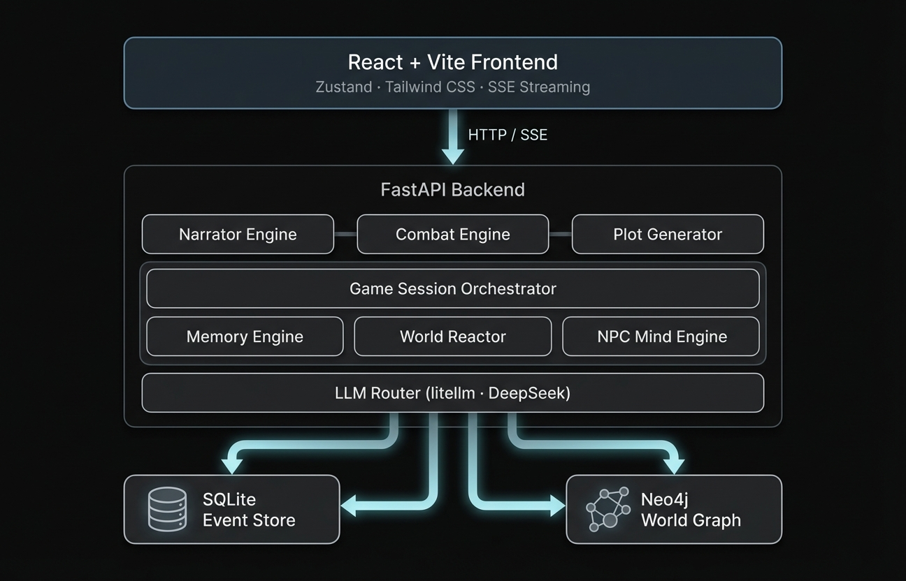

<p align="center">
  
</p>

<p align="center">
  <strong>An open-source storytelling engine where every choice reshapes the world.</strong><br>
  <sub>Authors create worlds. Players live adventures. AI narrates everything.</sub>
</p>

<p align="center">
  <a href="#features">Features</a> &middot;
  <a href="#quickstart">Quickstart</a> &middot;
  <a href="#architecture">Architecture</a> &middot;
  <a href="#combat-system">Combat System</a> &middot;
  <a href="#contributing">Contributing</a>
</p>

---

## What is Project Lunar?

Project Lunar is a **local-first** narrative RPG platform powered by AI. Authors build scenarios with lore, NPCs, locations, and factions. Players live through dynamically generated adventures narrated by LLMs with persistent memory, a reactive world, and creativity-based combat.

No HP bars. No mana pools. No grinding. Just **storytelling**.

---

## Features

| | Feature | Description |
|---|---------|-------------|
| **Narrator** | Mode-Aware Engine | Switches between Narrative, Combat, and Meta modes with real-time SSE streaming |
| **Memory** | Crystal Memory | 3-tier system (raw events > short crystals > long crystals) — the AI never forgets |
| **World** | Reactive World | Off-screen world evolves proportionally to narrative time |
| **Combat** | Creativity-Based | No stats — actions scored on coherence, creativity, and context |
| **NPCs** | Independent Minds | Each NPC maintains private thoughts updated by the LLM |
| **Graph** | Knowledge Graph | Neo4j-powered entity tracking with temporal relationships |
| **Journal** | Auto-Detection | AI identifies significant events and logs them automatically |
| **Plots** | Plot Generator | On-demand generation of NPCs, events, and story arcs |
| **Scenarios** | Builder + Import/Export | Create and share worlds as JSON with AI lore extraction |

---

## Quickstart

### Prerequisites

- **Python 3.10+**
- **Node.js 18+**
- **Docker** (for Neo4j)
- A **DeepSeek API key** ([get one here](https://platform.deepseek.com/))

### Install & Run

```bash
# Clone
git clone https://github.com/horizonfps/project-lunar.git
cd project-lunar

# One-command setup
./install.sh          # Linux/macOS
# install.bat         # Windows

# Configure
cp .env.example .env
# Edit .env → add your DEEPSEEK_API_KEY

# Start Neo4j
docker-compose up -d neo4j

# Backend
cd backend
source venv/bin/activate   # venv\Scripts\activate on Windows
uvicorn app.main:app --reload --port 8000

# Frontend (new terminal)
cd frontend
npm run dev
```

Open **http://localhost:5173** and start your adventure.

### Configuration

```env
DEEPSEEK_API_KEY=sk-...
NEO4J_URI=bolt://localhost:7687
NEO4J_USER=neo4j
NEO4J_PASSWORD=lunar_password
```

---

## How to Play

1. **Create a Scenario** — Fill in world details, paste free-form lore (AI extracts entities automatically), add story cards
2. **Play** — Select a scenario and dive in
3. **Act** — Use the action selector:
   - **DO** — Perform a physical action
   - **SAY** — Speak in character
   - **CONTINUE** — Let the story flow
   - **META** — Ask the narrator about the world

---

## Architecture

<p align="center">
  
</p>

---

## Combat System

Project Lunar uses a **creativity-based combat system** — no HP, mana, or levels.

Every action is evaluated on three axes:

| Axis | Score | Description |
|------|-------|-------------|
| **Coherence** | 0–10 | Does the action make sense in context? |
| **Creativity** | 0–10 | Is it original and unexpected? |
| **Context** | 0–10 | Does it use the environment and narrative? |

| Outcome | Effect |
|---------|--------|
| Critical Success | Spectacular success + 1 free action |
| Success | Action succeeds as intended |
| Fail | Action fails, story continues |
| Critical Fail | Action backfires — NPC gains +2 actions |

Anti-griefing rejects meta-gaming and physically impossible actions.

---

## Tech Stack

| Layer | Technology |
|-------|-----------|
| Frontend | React 18 · Vite · Zustand · Tailwind CSS |
| Backend | Python 3.11 · FastAPI · SQLite |
| Knowledge Graph | Neo4j (Docker) |
| LLM | DeepSeek via litellm |
| Visualization | react-force-graph-2d |

---

## Project Structure

```
project-lunar/
├── backend/
│   └── app/
│       ├── api/            # FastAPI routes (game, scenarios)
│       ├── db/             # Event store, scenario store
│       ├── engines/        # Narrator, combat, memory, world reactor, NPC minds
│       ├── services/       # Game session orchestrator, scenario service
│       └── main.py         # App entry point
├── frontend/
│   └── src/
│       ├── components/     # GameCanvas, CombatOverlay, JournalPanel, WorldMap...
│       ├── store.js        # Zustand state management
│       ├── api.js          # API + SSE helpers
│       └── App.jsx         # Routes
├── docker-compose.yml      # Neo4j
├── .env.example            # Environment template
└── install.sh              # One-command setup
```

---

## Running Tests

```bash
cd backend
source venv/bin/activate
pytest tests/ -v --cov=app --cov-report=term-missing
```

---

## Contributing

Contributions are welcome! This is an open-source project built for the community.

1. Fork the repository
2. Create your feature branch (`git checkout -b feat/amazing-feature`)
3. Write tests for your changes
4. Run `pytest tests/ -v` to verify
5. Open a Pull Request

---

## Acknowledgments

- **[Inner-Self](https://github.com/LewdLeah/Inner-Self)** by LewdLeah — Inspiration for NPC inner thoughts and personality systems
- **AI Dungeon** — Pioneering AI-driven interactive fiction and story cards
- **Graphiti** — Temporal knowledge graph concepts
- **litellm** — Multi-provider LLM abstraction

---

## License

MIT

---

<p align="center">
  <sub>Every story is unique. Every choice matters.</sub>
</p>
